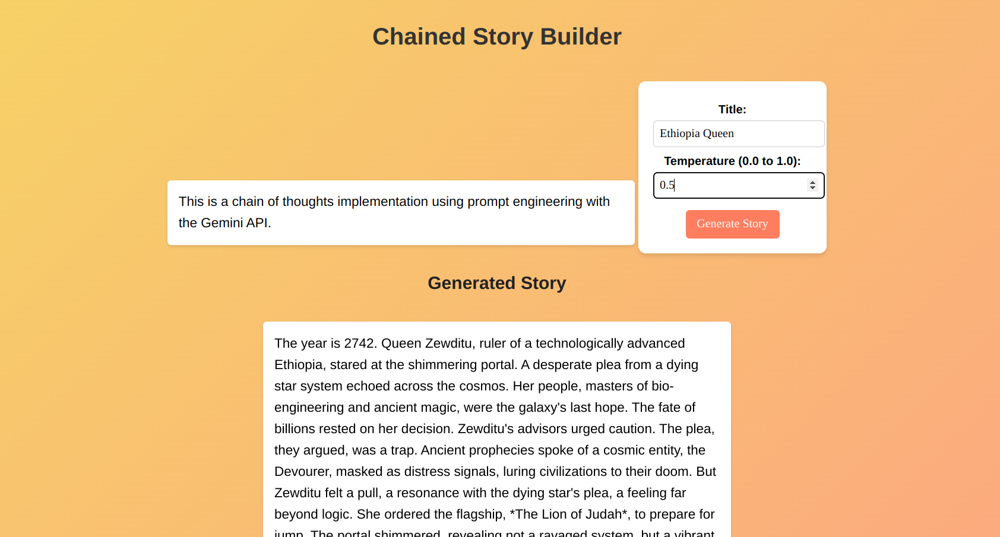

## Story Teller application Using Chaining of prompts


### Description
This is a simple story teller application that uses chaining of prompts to get user input and display the story at the end. The user can also set the **temprature** of what thier story should look like. The application uses gemini free AI model to write the story. The application also has a simple user interace and a Django backend server to handle the requests.


**The application is deployed on render using docker**

**Render Live Link** : https://storybuilder-s0f9.onrender.com/




### Logical flow
- a user inserts a title for the story they want to be written
- a well curated prompt is generated and after 3 chain of prompts, the prompt is sent to the AI model to generate the story
- the story is displayed to the user.

### File Structure
- `gemini_utils.py` : contains the utility functions for the gemini model. It contains the function to generate the prompt and the function to generate the story.
    The core function is shown below

   ```python

    def generate_story(title, user_temperature=0.3):
    # Step 1: Opening
    prompt1 = f"Write a 50-word opening for a sci-fi story titled '{title}'."
    response1 = model.generate_content(prompt1, generation_config={"temperature": user_temperature})
    opening = response1.text.strip()

    # Step 2: Plot Twist
    temperature_for_twist = min(user_temperature + 0.3, 1.0)
    prompt2 = f"Continue this story: '{opening}' with a surprising plot twist, in 150 words."
    response2 = model.generate_content(prompt2, generation_config={"temperature": temperature_for_twist})
    twist = response2.text.strip()

    # Step 3: Conclusion
    full_story_so_far = opening + " " + twist
    prompt3 = f"Conclude this story: '{full_story_so_far}' in a hopeful tone, in 100 words."
    response3 = model.generate_content(prompt3, generation_config={"temperature": user_temperature})
    conclusion = response3.text.strip()

    # Combine the story parts
    full_story = f"{opening} {twist} {conclusion}"
    return full_story
    ```


   -`views.py` : Contains the views for the Django application. It contains the backend functionality for the application.
   - `index.html` : Contains the frontend for the application. It contains the user interface for the application.
    - `Dockerfile` : Contains the docker configuration for the application.
    - `requirements.txt` : Contains the dependencies for the application.
### How to run the application
- Clone the repository
- Install the dependencies using `pip install -r requirements.txt`
- Run the Django server using `python manage.py runserver`


